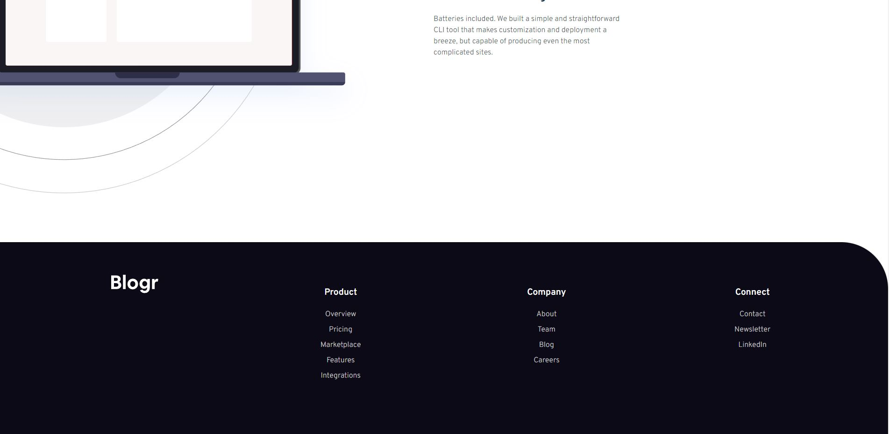

# Blogr landing page solution by Eivind Simonsen

This is a solution to the [Blogr landing page challenge on Frontend Mentor](https://www.frontendmentor.io/challenges/blogr-landing-page-EX2RLAApP).

## Table of contents

- [Overview](#overview)
  - [The challenge](#the-challenge)
  - [Screenshot](#screenshot)
  - [Links](#links)
- [My process](#my-process)
  - [Built with](#built-with)
  - [What I learned](#what-i-learned)
- [Author](#author)

## Overview

### The challenge

Users should be able to:

- View the optimal layout for the site depending on their device's screen size (This case mobile width: 375px, desktop: 1440px)
- See hover states for all interactive elements on the page
- Code the design as close as possible to design files provided

### Screenshot

### Links

- Solution URL: [GitHub repo](https://github.com/eivindsimonsen/blogr-landing-page)
- Live Site URL: [Live site](https://blogr-eas.netlify.app/)

## My process

### Built with

- Flexbox
- CSS Grid
- Mobile-first workflow
- [React](https://reactjs.org/) - JS library
- [SASS](https://sass-lang.com/documentation/) - CSS framework

### What I learned

I've learnt that for responsive design, using position absolute on several items is a bad idea, and should probably be avoided.

## Author

- Website - [easimonsen.com](https://www.easimonsen.com/)
- LinkedIn - [@eivindsimonsen](https://www.linkedin.com/in/eivind-simonsen-9469121b9/)
